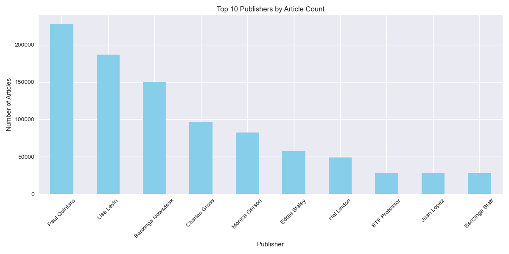
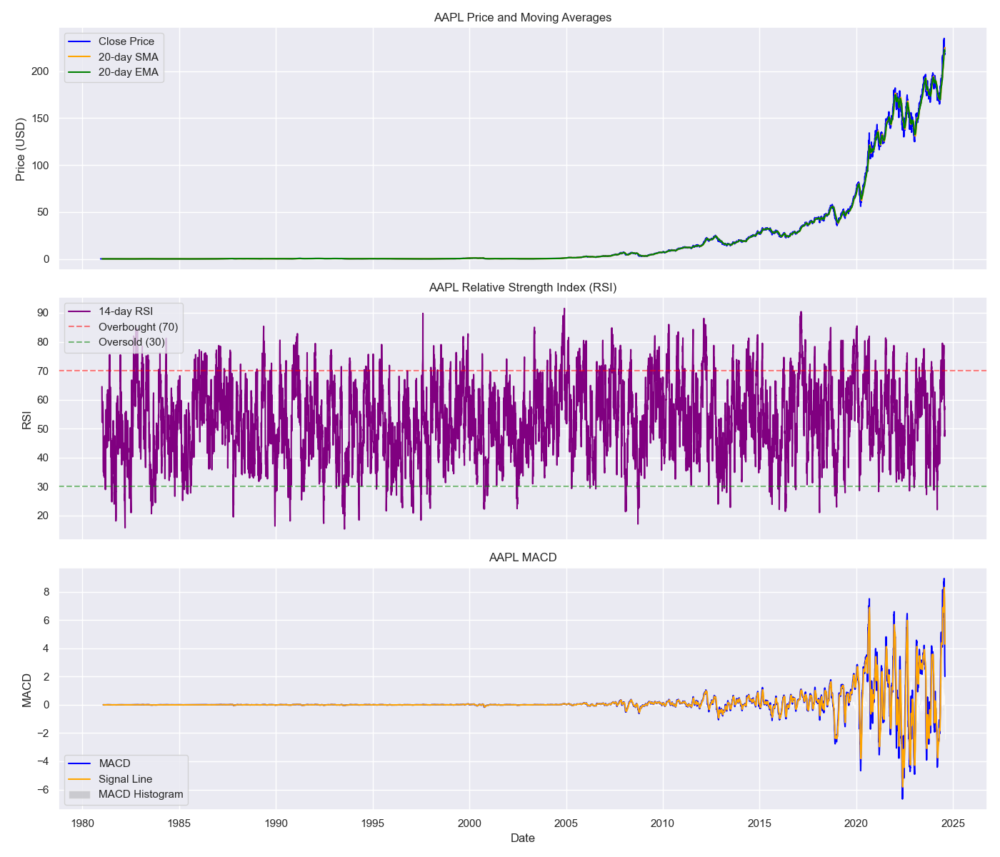
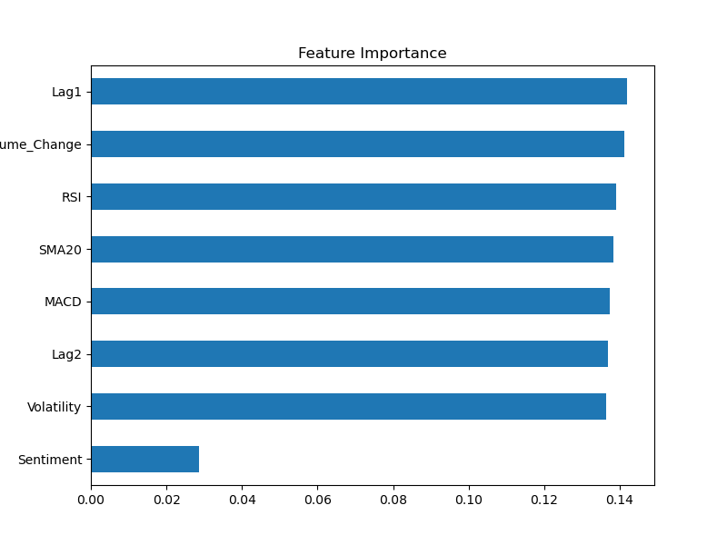

#  Predicting Stock Price Movement

Welcome to the 10 Academy Week 1 Challenge project! This repository explores how financial news sentiment and technical indicators can be combined to predict daily stock price movements across multiple companies such as AAPL, AMZN, MSFT, TSLA, and more.


---

##  Project Overview

This project is divided into three key tasks:

- **Task 1 – Exploratory Data Analysis (EDA):**  
  Analyze financial news headlines (e.g., raw_analyst_ratings.csv) for trends in sentiment, length, and publisher behavior.

- **Task 2 – Quantitative Technical Analysis:**  
  Compute technical indicators like RSI, MACD, SMA20, and volatility using historical stock data (e.g., AAPL_historical_data.csv, MSFT_historical_data.csv).

- **Task 3 – Predictive Modeling:**  
  Train a machine learning model (Random Forest) using both sentiment and technical features to predict stock price direction (up/down).

---

##  Datasets

- **News Data:** `raw_analyst_ratings.csv` – contains headlines, date, and publisher.
- **Stock Data:** `AAPL_historical_data.csv` – contains daily price and volume data.

---


### 📊 Key Results

| Task              | Highlights                                                                                           | Visual Example |
|------------------|------------------------------------------------------------------------------------------------------|----------------|
| **EDA**           | Top publishers identified (e.g., Benzinga), most headlines 5–15 words, sentiment mostly neutral      |  |
| **Tech Analysis** | RSI and MACD revealed overbought/oversold periods; volatility spikes matched news                    |  |
| **Modeling**      | Random Forest accuracy ~51%; technical indicators most predictive, sentiment moderately helpful       |  |


---


##  Repository Structure
```
notebooks/
├── task1_eda.ipynb # News headline EDA
├── task2_quantitative_analysis.ipynb # Technical indicators
├── task3_modeling.ipynb # Predictive modeling
├── git_push.ipynb # Git automation script

assets/
├── task1/ # EDA visuals
├── task2/ # Technical charts
├── task3/ # Model outputs

models/
└── rf_model.pkl # Trained model
```
---

## ⚙️ Getting Started

### Prerequisites

- Python 3.9+
- Conda (recommended)
- [TA-Lib installed manually](https://mrjbq7.github.io/ta-lib/install.html)

### Setup Instructions

```bash
# Clone the repo
git clone https://github.com/yesufma/Predicting-Stock-Price.git
cd Predicting-Stock-Price

# Set up environment
conda create -n taenv python=3.9
conda activate taenv
pip install -r requirements.txt

# Run Jupyter
jupyter notebook
Run the notebooks in order:

1. task1_eda.ipynb

2. task2_quantitative_analysis.ipynb

3. task3_modeling.ipynb
```
# Future Improvements
Use LSTM or gradient boosting models for better temporal prediction

Add macroeconomic indicators or trading volume as features

Expand to other stocks (e.g., MSFT, TSLA) for generalization

# Acknowledgements
10 Academy – for the challenge and guidance

Libraries Used – pandas, scikit-learn, ta-lib, TextBlob, matplotlib, seaborn, and more

